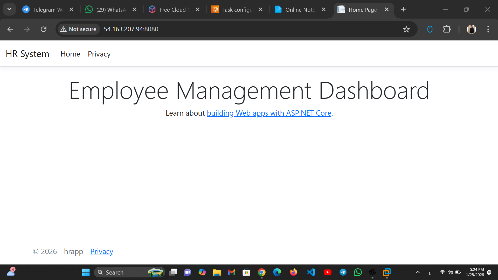
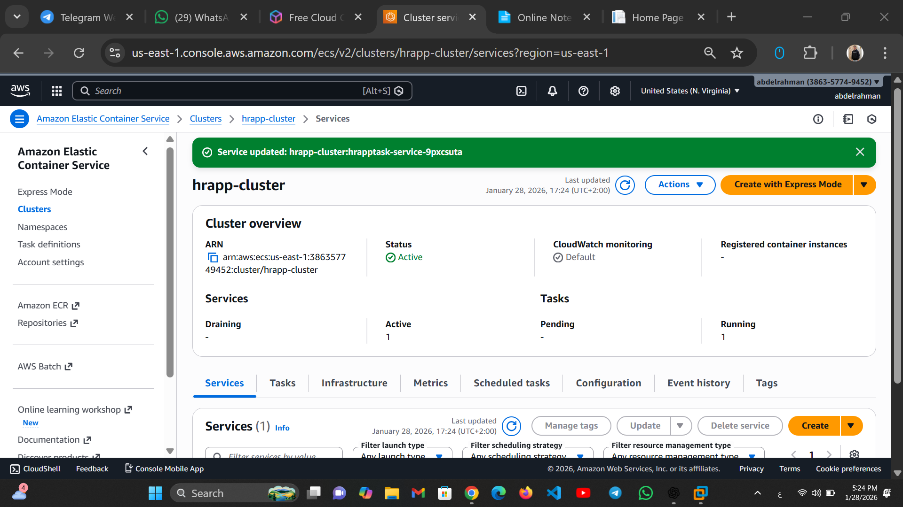
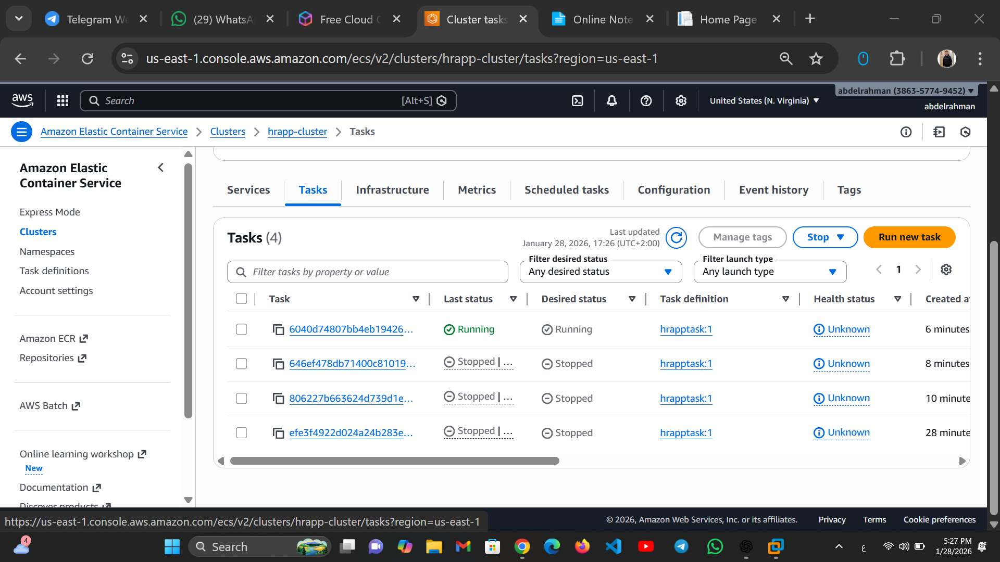

# Employee Management System (HR System)

A Dockerized ASP.NET Core application deployed on AWS ECS Fargate.
This project demonstrates real-world containerization and cloud deployment.

---

## 🚀 Live Demo
http://54.163.207.94:8080

---

## 🧰 Tech Stack
- ASP.NET Core
- Docker
- AWS ECS (Fargate)
- AWS ECR
- AWS IAM
- AWS CloudWatch

---

## 📌 Features
- Employee Management Dashboard
- Dockerized application
- Deployed on AWS ECS Fargate
- Public access via ECS Task Public IP
- Real cloud deployment with troubleshooting

---

## 🏗️ Architecture
1. ASP.NET Core application containerized using Docker
2. Docker image pushed to Amazon ECR
3. Application deployed on AWS ECS Fargate
4. Public access enabled via Security Groups

---

## 🖼️ Screenshots

### 🔹 Application Running


### 🔹 ECS Cluster


### 🔹 ECS Task Running


---

## 🛠️ Deployment Steps (Summary)
```bash
docker build -t dockerhrapp .
docker tag dockerhrapp:latest <account-id>.dkr.ecr.us-east-1.amazonaws.com/dockerhrapp:latest
docker push <account-id>.dkr.ecr.us-east-1.amazonaws.com/dockerhrapp:latest

👨‍💻 Author

Ahmed Hamed
Cloud & DevOps Engineer
